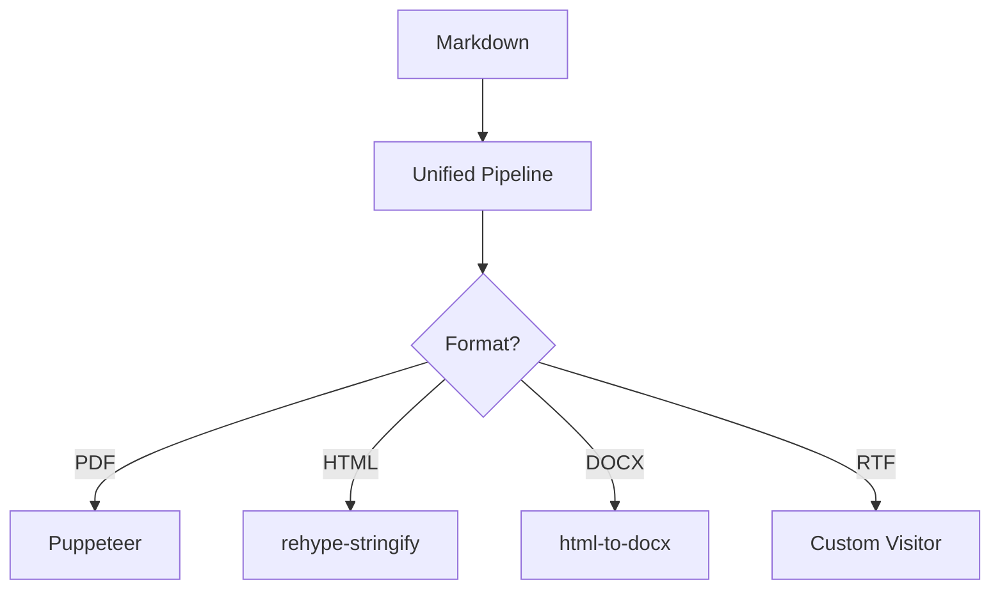

# Markdown Export — Kitchen Sink

A single document that exercises every feature the extension supports.

## Inline formatting

This paragraph contains **bold**, *italic*, ***bold-italic***, `inline code`,
~~strikethrough~~, [a link](https://example.com), and an autolink:
<https://anthropic.com>.

A footnote reference[^1] should land in the footnotes block at the end.

[^1]: Footnotes are rendered by `remark-gfm`.

## Lists

### Bulleted

- First item
- Second item, with **nested formatting**
  - Nested bullet
  - Another nested bullet
- Third item

### Numbered

1. Set the page size
2. Choose a theme
3. Run "Export as PDF"

### Task list

- [x] Render headings
- [x] Render tables
- [ ] Cure all known bugs
- [ ] Achieve world peace

## Tables

| Format | Status | Notes                            |
| ------ | :----: | -------------------------------- |
| PDF    |  ✅   | Phase 1                          |
| HTML   |  ✅   | Phase 1                          |
| DOCX   |  ⏳   | Phase 4                          |
| RTF    |  ⏳   | Phase 5 — custom rehype visitor |
| EPUB   |  ⏳   | Phase 4                          |
| XML    |  ⏳   | Phase 4 — DocBook subset        |
| PNG    |  ⏳   | Phase 4                          |

## Code blocks

```ts
// TypeScript with Shiki highlighting
export async function buildHtml(source: string): Promise<string> {
  const file = await unified()
    .use(remarkParse)
    .use(remarkGfm)
    .use(remarkRehype)
    .use(rehypeStringify)
    .process(source);
  return String(file);
}
```

```bash
npm install
npm run build
```

## Math (KaTeX)

Inline: $E = mc^2$, $\sum_{i=1}^{n} i = \frac{n(n+1)}{2}$.

Block:

$$
\int_{-\infty}^{\infty} e^{-x^2} \, dx = \sqrt{\pi}
$$

## Mermaid diagram



## Blockquote

> "A program that has not been tested does not work."
> — Bjarne Stroustrup

## Horizontal rule

---

## Image


## Page break test

The next page should start after this line.

<!-- pagebreak -->

## After the page break

If you can read this on a new page in PDF output, the page-break directive works.

## Closing

End of fixture. Export this file with each of the seven format commands and
verify the output visually.
